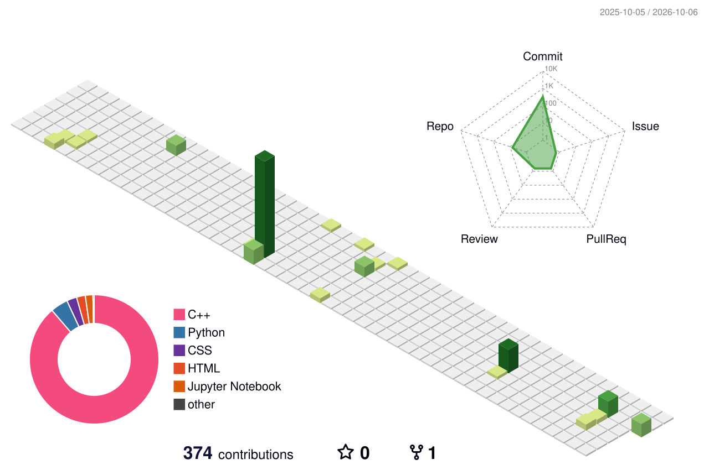

<!--
  ═══════════════════════════════════════════════════════════════════
  NITTA NANDO ROY · GitHub Profile README
  Theme: "Droid" — R2-D2 blue/silver on deep-space navy
  Personalized from CV: 5× IEEE publications · DIU NLP & ML Research Lab
  ═══════════════════════════════════════════════════════════════════
-->

  

---

## 🤖 About Me

- 🎓 **B.Sc. in Computer Science & Engineering**, Daffodil International University — **CGPA 3.68 / 4.0**
- 🔬 **Research Assistant @ DIU NLP & ML Research Lab** — Bangla NLP and code-mixed text classification
- 📚 **5× IEEE conference publications** in machine learning and language technologies
- 👨‍🏫 Trained and mentored **250+ students** as Bootcamp Trainer (50+) and Lab Prefect (200+)
- 🛠️ Building practical AI systems with **Python**, **Scikit-learn**, **Hugging Face**, **OpenAI API**, **Django / FastAPI**
- 📍 Dhaka, Bangladesh

 

## 📚 Publications

**5 IEEE conference papers** — full list on [Google Scholar](https://scholar.google.com/citations?user=jSSDWU8AAAAJ&hl=en&authuser=1).

[1] **"Bridging Classical and Colloquial Bangla: Using Large Language Models for Sadhu–Cholit Register Classification."** — *AISEI (IEEE), Irbid, Jordan, Apr. 2026* — [DOI](https://doi.org/10.1109/AISEI68628.2026.11572911)

[2] **"Automatic Classification of Banglish and English Text Using TF-IDF and Machine Learning Models."** — *AISEI (IEEE), Irbid, Jordan, Apr. 2026* — [DOI](https://doi.org/10.1109/AISEI68628.2026.11572934)

[3] **"A Comparative Study of LSTM and Bi-LSTM Architectures with Attention for Bangla News Classification."** — *IDAA, Dhaka, Bangladesh, Dec. 2025* — [DOI](https://doi.org/10.2991/978-94-6239-664-7_31)

[4] **"Efficient Bangla Tense Classification Using GRU, LSTM, and Bidirectional Approaches."** — *ECCE (IEEE), Chittagong, Bangladesh, Feb. 2025* — [DOI](https://doi.org/10.1109/ECCE64574.2025.11012984)

[5] **"Enhancing Bangla Fake News Detection By Using A Deep Learning Approach."** — *ICCIT (IEEE), Cox's Bazar, Bangladesh, Dec. 2024* — [DOI](https://doi.org/10.1109/ICCIT64611.2024.11021965)

## 💼 Experience & Leadership

**Research Assistant** — DIU NLP & ML Research Lab *(Sep 2025 – Aug 2026)*
Conducting research on **Bangla NLP and code-mixed text classification**; preparing and analyzing datasets for ML/DL experiments; contributing to model development, evaluation and performance improvement.

**Bootcamp Trainer — Basic Python to Machine Learning** — DIU NLP & ML Research Lab *(Oct 2025 – Apr 2026)*
Trained **50+ students** in Python, data preprocessing and machine learning through practical sessions with **Pandas, NumPy and Scikit-learn**.

**Lab Prefect — Data Structures & Programming** — Daffodil International University *(Jul 2023 – Apr 2025)*
Guided **200+ students** in programming and problem-solving; evaluated assignments and provided debugging support.

**Community** — Volunteer, National Data Analytics Competition (NDAC 2025) · Contest Organizer, Crack Dataset (CD-2024) · Participant, Unlock the Algorithm 2023 & DIU Take Off 2022

## 🎓 Education

**B.Sc. in Computer Science & Engineering** — Daffodil International University, Dhaka *(May 2022 – May 2026)*
**CGPA: 3.68 / 4.0**

**Research interests**

**Relevant coursework** — Machine Learning · Artificial Intelligence · Data Mining · Database Systems · Data Structures · Algorithms · Object-Oriented Programming · Natural Language Processing

## 🏆 Honors & Awards

**3rd** — DIU Capture The Flag Contest 2024 · Cyber Security Club
**2nd** — DIU CodeTrap Programming Contest 2023 · Software Engineering Club

## ⚙️ Tech Stack

  

## 🚀 Featured Projects

<!-- ✏️ EDIT: AoF + Smart Farming descriptions are inferred (not on CV) — adjust if needed -->

### 🇧🇩 [Banglish vs. English Detector](https://github.com/NnR2D2/Banglish-vs-English-Detector)

NLP classification model that distinguishes Banglish from English text — built with **Scikit-learn** and reaching **99.31% accuracy**, with a **Streamlit** dashboard for live prediction and model performance analysis. The approach behind it is published at IEEE AISEI 2026 (paper [2] above).

---

### 🧭 [AI Search Visualizer](https://github.com/NnR2D2/ai-search-visualizer)

Interactive tool that visualizes **A\***, **BFS**, **DFS** and **UCS** pathfinding algorithms step by step — making heuristic search behavior visible and intuitive for learning and teaching.

---

### 🛒 [Euzaar](https://euzaar.com)

Full-stack **e-commerce platform** built with **Django**, **PostgreSQL** and **REST APIs** — covering authentication, product management, order workflows and payment integration. Deployed and live at [euzaar.com](https://euzaar.com).

---

### 🧹 [E-commerce Product Scraper](https://github.com/NnR2D2/ecommerce_scraper)

Web-scraping pipeline that collects product **title, price, availability and rating**, then exports clean, structured data to **CSV** for analysis and reuse.

---

### 🔐 [Attack on Finances (AoF)](https://github.com/NnR2D2/Attack-on-Finances-AoF-Network-Security-Simulation)

Network-security simulation that models attack scenarios against a simulated financial environment — exploring threat behavior, attack surfaces and defensive response. Skills proven in practice: **3rd place, DIU CTF 2024**.

---

### 🌾 [Smart Farming with IoT & AI Monitoring](https://github.com/NnR2D2/Smart-Farming-with-IoT-and-AI-Monitoring)

IoT-driven smart-agriculture platform that streams field-sensor data into AI models for continuous crop-condition monitoring — data-driven decision-making for farming operations.

**More on GitHub:** [Restaurant Manager](https://github.com/NnR2D2/Restaurant-Maneger) · [Rain Alert System](https://github.com/NnR2D2/Rain-alert-system) · [TourNTravel](https://github.com/NnR2D2/TourNTravel) · [Python Project](https://github.com/NnR2D2/Python-Project)

## 📊 GitHub Metrics

  
  

  

  
  

<!-- 🕐 The two services below were over their free quota when this profile was built (HTTP 402).
     When they recover, just uncomment. They are the classic trophy + activity-graph cards:

  

  

-->

## 🛰️ Contribution Graph · 3D

<picture>
  <source media="(prefers-color-scheme: dark)" srcset="./profile-3d-contrib/profile-night-rainbow.svg" />
  
</picture>

*Generated automatically by GitHub Actions — see `.github/workflows/3d-contrib.yml`. Run the workflow once and this section comes alive.*

## 🐍 Contribution Snake

<picture>
  <source media="(prefers-color-scheme: dark)" srcset="https://raw.githubusercontent.com/NnR2D2/NnR2D2/output/github-contribution-grid-snake-dark.svg" />
  
</picture>

*The snake eats your contributions — powered by `.github/workflows/snake.yml`. Run the workflow once to generate it.*

## 🔗 Connect

